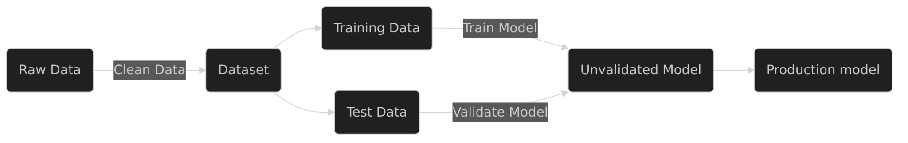
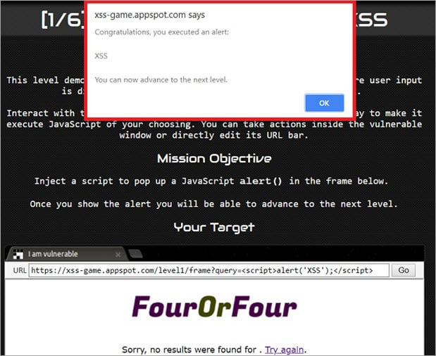

# AI Security in 2025

---

## About Me

- **Rahul Zhade**
- Sr. Product Security Engineer [@GitHub](https://github.com/rzhade3)

---

## Agenda
1. Intro to AI
1. SDLC Vulnerabilities from AI
1. Product Vulnerabilities from AI
1. MCP Security
1. Responsible AI Design
1. Incident Response

---

## Intro to AI

--

### AI Lifecycle

--

### Secure AI Framework

--

### AI vs Traditional Security

- Unstructured Inputs
- Side Channels
- Non-determinism
- Lack of explainability
- Lack of standards

--

### AI Usages in Software

- **Constructive**
  - AI that helps build software
- **Defensive**
  - AI that helps secure software (e.g. CI)
- **Integrated**
  - AI that is part of the product

---

## Security Considerations for AI SDLC

--

### AI Usages in SDLC
- **Constructive:**
  - Copilot, Cursor, etc.
- **Defensive:**
  - CI, Copilot Code Review, etc.

--

### Constructive AI Risks

- Prone to hallucinations
  - e.g., [Slopsquatting](https://en.wikipedia.org/wiki/Slopsquatting)
- Can ingest and possibly exfiltrate sensitive data

--

### Controls to Apply

- Properly review suggested code
- Use [content exclusions](https://docs.github.com/en/copilot/how-tos/configure-content-exclusion)
- Plan architecture in advance
- Add context via comments
- Use static and dynamic analysis

--

### Defensive AI

- More context-aware than SAST
- Easier rule writing
- Prone to hallucinations, prompt injection

---

## Product Vulnerabilities from AI

--

### Types of Vulnerabilities

| Data Lifecycle | Infrastructure | Emergent Issues |
|----------------|----------------|-----------------|
| Sensitive Info Disclosure | Supply Chain Vulns | Prompt Injection |
| Data/Model Poisoning | Unbounded Consumption | Improper Output Handling |
| | Model Theft | Excessive Agency |
| | | Hallucination |

--

### Data Lifecycle

> AI is leaky!

- Inputs can be repeated verbatim
- Side channels
- Huge training datasets
- **Control:** Only use trusted, secure data

--

### Data Lifecycle Controls

- PII Redaction
- Careful Data Selection
- Differential Privacy (if possible)

--

### Infrastructure

> AI Infrastructure is non-trivial

- Expensive
- Bespoke dependencies
- Unsafe defaults

--

### Infrastructure Controls

- CI/CD pipelines (e.g., Wiz, TFSec)
- Rate limiting
- Logging

--

### Emergent Issues

> People don't know how to use AI

- Ambiguous intent
- Misunderstood APIs
- Prompt Injection, Excessive Agency, etc.

--

### Improper Output Handling

> Output from LLMs must be sanitized

--

### Controls

- Context-aware output encoding
- Don't allow unsanitized output in sensitive contexts (UIs, shells)
- Use HITL for state changes

--

### Excessive Agency

> AI may hallucinate or take wrong actions

--

### Controls

- Human in the Loop (HITL)
- Responsible agent design
- Educate users

--

### Hallucination / Misinformation

- Inform users of AI limitations
- HITL: Keep human in the loop

--

### Hallucination Controls

- Use Retrieval Augmented Generation (RAG)
- Off topic filtering
- User disclosures that AI may hallucinate

--

### Prompt Injection

--

### Types of Prompt Injection

* User Prompt Injection (UPIA)
  - Jailbreaks, etc.
* Cross Prompt Injection (XPIA)
  - MCP Vulnerabilities, etc.

--

### Prompt Injection Controls

- Clear context
  - Remove invisible characters
  - Disclose all context that was used (files, websites, etc.)
- Content filtering
- [Dual LLM](https://simonwillison.net/2023/Apr/25/dual-llm-pattern/) / Nanny Agents
- [CaMeL](https://arxiv.org/abs/2503.18813)/ Information Control Flow

---

## MCP Security

--

### Issues with MCP

* Authorization
* Supply Chain
* XPIA Risk
* Context Poisoning

--

### Using MCP Safely

1. Audit source code for any local MCP
1. Use credentials with least privilege
1. Use firewalls to ensure agents stay on guardrails
1. Properly define resources and tools

--

### MCP Security Specifications

* [OAuth 2.1 Support](https://modelcontextprotocol.io/specification/2025-06-18/basic/authorization)
* [Enhanced Tool Definition Interface](https://arxiv.org/html/2506.01333v1)

---

## Responsible AI

--

### Good Design Prevents Footguns

--

### Human in the Loop

- Protect users from themselves
- User consent flows for all state-changing actions
- Balance usability and security, be mindful of user fatigue

--

### AI Disclosures

- Disclose all AI usage
- Explicit user consent for state-changing actions

--

### Content Filtering

- Prevent harmful/off-topic content

--

### Agentic Security Principles

1. Make sure agents can be turned off
1. Network interactions should be logged and firewalled
1. Log who initiated the action, and input context
1. Run workflows in ephemeral environments
1. Do not give an agent access to sensitive data

---

## Incident Response for AI

--

### New Challenges

- Non-determinism
- Higher media scrutiny
- Potentially higher financial impact
- Varying customer expectations

--

### Principles

- Logging & Monitoring
- Rate Limits
- Generous Logging (Reproducibility is hard)
- Set Customer Expectations

---

## Conclusion

--

### Key Takeaways

- Secure the whole AI lifecycle
- **Responsible AI Design!**
  - HITL HITL HITL
- Same risks, higher stakes
- Don't trust AI blindly

---

## Further Reading

- [Adversarial AI Reading List](https://github.com/rzhade3/adversarial-ai-reading-list)
- [Simon Willison Blog](https://simonwillison.net/tags/security/)
- [embracethered.com](https://embracethered.com/)
